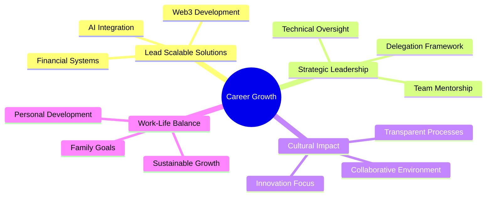

---
# You can also start simply with 'default'
theme: seriph
# random image from a curated Unsplash collection by Anthony
# like them? see https://unsplash.com/collections/94734566/slidev
background: https://images.unsplash.com/photo-1451187580459-43490279c0fa?q=80&w=2072&auto=format&fit=crop
# some information about your slides (markdown enabled)
title: Pieter Venter - Satoshi Energy
info: |
  ## Slidev Starter Template
  Presentation slides for developers.

  Learn more at [Sli.dev](https://sli.dev)
# apply unocss classes to the current slide
class: 'text-center'
# https://sli.dev/features/drawing
drawings:
  persist: false
# slide transition: https://sli.dev/guide/animations.html#slide-transitions
transition: slide-left
# enable MDC Syntax: https://sli.dev/features/mdc
mdc: true
highlighter: shiki
lineNumbers: false
---

# Pieter Venter
Engineering Leadership & Innovation

  
    Press Space for next page <carbon:arrow-right class="inline"/>
  

  <a href="https://github.com/satoshienergy" target="_blank" alt="Satoshi Energy GitHub" class="text-xl slidev-icon-btn opacity-50 !border-none !hover:text-white">
    <carbon-logo-github />
  </a>

---
transition: fade-out
---

# Presentation Overview

- 🚀 **Introduction** - Engineering Leadership & Innovation
- 💼 **Professional Journey** - 15+ Years of Software Engineering Excellence
- 📈 **Recent Leadership Experience** - Scaling Teams and Systems
- 🎓 **Educational Foundation** - Technical Expertise & Business Acumen
- 🎯 **Five-Year Vision** - Growth and Innovation Path
- ⚡ **Why Satoshi Energy** - Alignment and Contribution
- 🤝 **Thank You** - Looking Forward to Collaboration

---
layout: two-cols
---

# Professional Journey

<v-clicks>

- **13+ Years** in Engineering
- **10+ Years** in Leadership Roles
- **15+ Projects** Successfully Delivered
- Focus on Sustainable Growth & Innovation
- Strong Background in:
  - Platform Architecture
  - Developer Experience (DX)
  - Cross-functional Leadership
  - AI & Automation Systems

</v-clicks>

::right::

  

    
60%

    
Year-over-Year Productivity Increase

  

  

    
64%

    
Improved Development Turnaround Time

  

  

    
5K+

    
Customer Data Points Processed via API

  

---
layout: default
---

# Recent Leadership Experience

## Principal Engineer
### Invisible Technologies

- Scaled engineering team from 12 to 32 members
- Architected systems crucial for $100M ARR
- Implemented Kubernetes infrastructure
- Led cross-functional alignment initiatives
- Developed AI-driven Process Engine
- Cultural anchor during rapid scaling

## Senior Engineer
### Mana

- Platform architecture leadership
- Enhanced developer experience (DX)
- Added Monitoring & Observability
- Added CI/CD pipeline
- Built a RAG system
- Proactive problem-solving approach

---
layout: center
class: "text-center"
---

# Educational Foundation

## Academic Background
- BComm Management Sciences
- Double Major:
  - Financial Management
  - Information Systems
- Stellenbosch University

## Technical Skills
- Systems Architecture
- Python, TypeScript, SQL
- AI/ML Integration
- Business Analytics
- Scalable Solutions

---
layout: default
---

# Five-Year Vision

---
layout: two-cols
class: gap-8
---

# Why Satoshi Energy?

<v-clicks>

- Innovative Energy-Bitcoin Synergy
- Cross-disciplinary Platform Development
- Spec-driven Development Culture
- Clear Communication Values
- Balanced Technical Approach

</v-clicks>

::right::

# What I Bring

- Scaling Experience
- Infrastructure Optimization
- Cross-team Collaboration
- AI Integration
- Event-driven Architecture

---
layout: center
class: text-center
---

# Thank You

Looking forward to contributing to Satoshi Energy's mission

  
Contact Information

  

    <carbon-email class="inline-block mr-2"/> Available Upon Request
  

